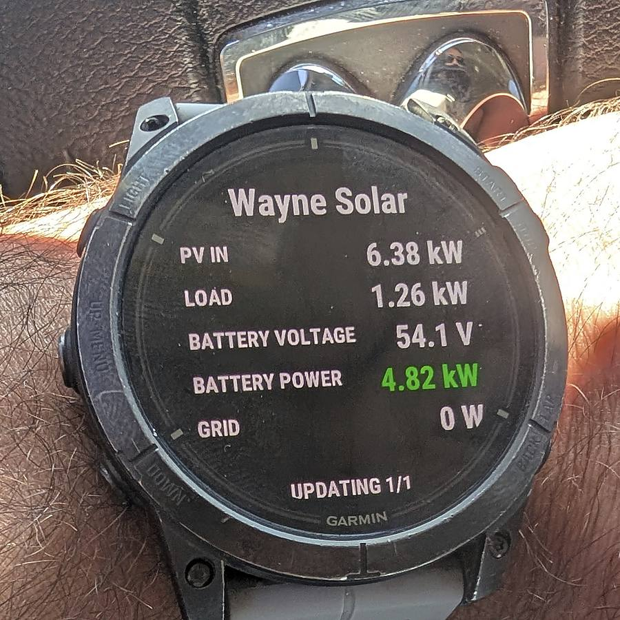
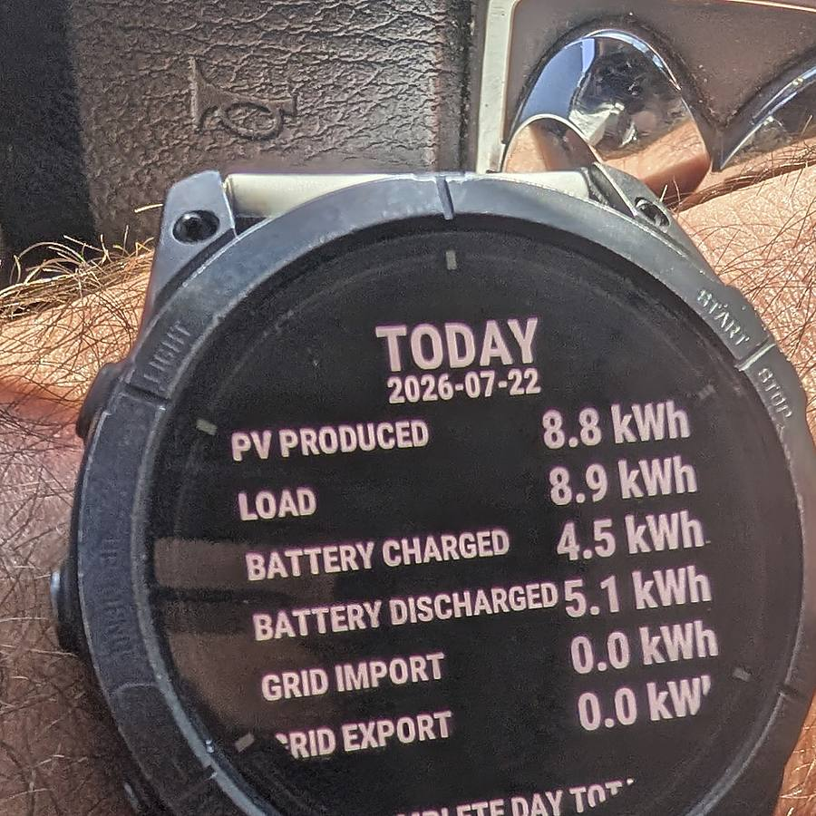

# Solar Assistant Garmin

A community-built Garmin Connect IQ watch app and complication publisher for solar-system data. It displays live production and consumption, stores daily totals, provides a glance, and publishes four public complications that can be used by Garmin Face It and compatible watch faces.

> **Unofficial project:** This repository is not affiliated with or endorsed by Garmin or Solar Assistant.

## What it publishes

| Complication | Example |
|---|---:|
| Current Load | `3.8kW` |
| Current PV | `7.4kW` |
| PV Produced Today | `32.6kWh` |
| Battery Voltage | `53.2V` |

The app also shows live PV, load, battery power, grid power, battery voltage, and a second page of daily energy totals.

<p align="center">
  
  
</p>

## Architecture

```text
Solar Assistant / Home Assistant / custom telemetry
                    │
                    │ MQTT or another local integration
                    ▼
      Your read-only HTTPS JSON bridge
                    │
                    │ Authorization: Bearer <token>
                    ▼
        Garmin Connect IQ watch app
                    │
                    ├── live app and glance
                    └── four public complications
```

The Garmin app does **not** connect directly to MQTT. It expects one authenticated HTTPS endpoint implementing the JSON contract in [docs/API.md](docs/API.md).

## Current status

- Proven on an **epix Pro (Gen 2) 51 mm**.
- Foreground data refresh every 30 seconds while the app is open.
- Background complication refresh requested every five minutes.
- Cached values are marked unavailable when the source is disconnected or the data is stale.
- Public complication discovery works in Garmin Face It when the app is installed through Connect IQ beta distribution.

Other Connect IQ devices may work after being added with **Monkey C: Edit Products**, but they have not all been tested.

## Build

### Requirements

- Garmin Connect IQ SDK Manager
- Visual Studio Code
- Garmin Monkey C extension
- A Connect IQ developer key
- A public HTTPS endpoint matching the required API contract

### Configure

Clone the repository, then create the local configuration file:

```bash
./scripts/create-config.sh
```

Edit:

```text
source/SolarConfig.mc
```

Set your HTTPS bridge URL and a dedicated read-only bridge token. The local file is gitignored.

### Compile and test

1. Open the repository root in VS Code. `manifest.xml` and `monkey.jungle` must be visible at the workspace root.
2. Run **Monkey C: Edit Products** and select your watch.
3. Run **Monkey C: Run Project** and verify the app in the simulator.
4. In the simulator, open **Simulation → Complications** and confirm all four entries have values.
5. Run **Monkey C: Export Project** to create an `.iq` package.

See [docs/BUILD.md](docs/BUILD.md) for the full workflow, including beta installation and Face It.

## Security warning

The bridge token is compiled into the Garmin binary. Treat it as recoverable by anyone who receives the `.prg` or `.iq` package.

- Use a dedicated, read-only token scoped only to the summary endpoint.
- Never use a Solar Assistant administrator credential.
- Never publish a compiled package containing your private token.
- Rotate the token after accidental disclosure.
- Keep `source/SolarConfig.mc` out of Git; it is intentionally ignored.

Read [SECURITY.md](SECURITY.md) before distributing a build.

## Battery sign convention

This project assumes:

- Positive battery power = charging
- Negative battery power = discharging

The glance displays battery power as an absolute value and uses green for charging and red for discharging.

## Repository checks

Run:

```bash
./scripts/check-secrets.sh
xmllint --noout manifest.xml resources/complications.xml \
  resources/drawables/drawables.xml resources/strings/strings.xml
```

Create a sanitized source archive with:

```bash
./scripts/package-source.sh
```

## Roadmap

- Move endpoint and token entry into Connect IQ app settings.
- Add more tested Garmin device targets.
- Publish a generic reference bridge.
- Add configurable refresh intervals and complication labels.

## License

MIT. See [LICENSE](LICENSE).
